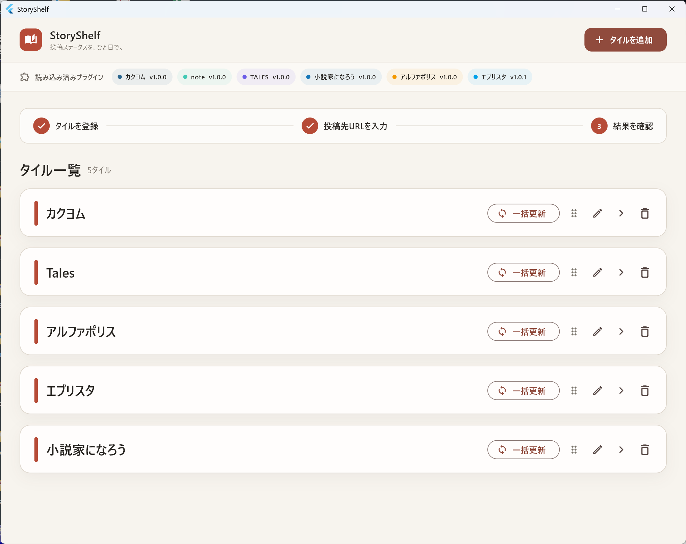
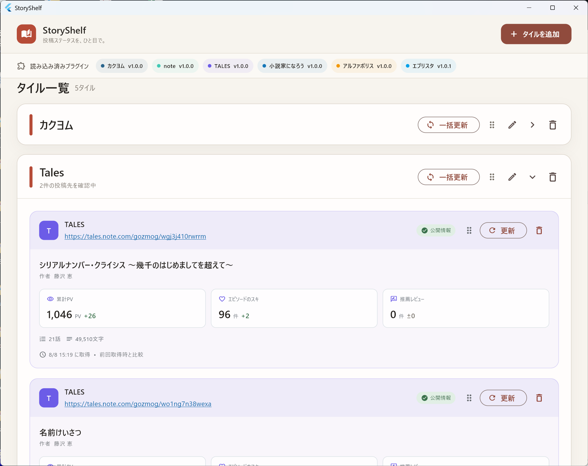

# StoryShelf

複数の小説・記事投稿サービスで公開している自作品の反応を、タイル形式でまとめて確認するWindowsアプリです。

> 現在はβ版です。投稿サービス側の画面変更などにより、情報を取得できなくなる場合があります。

## v0.9.1の主な変更

- GitHubの公式カタログから、アプリ本体を入れ替えずにプラグインを新規追加・更新
- 更新候補の一覧を表示し、ユーザーが確認した場合だけダウンロードとインストールを実行
- 更新操作をタイル単位に整理し、各URLタイルの作品タイトルと削除表示を見やすく調整
- プラグイン一覧の自動折り返しと、ウィンドウの最小サイズ設定に対応

## スクリーンショット

タイルを折りたたんだ一覧画面です。



タイルを展開すると、投稿先サービス固有の指標と前回取得時からの差分を確認できます。



## 対応サービス

- カクヨム
- note
- Tales
- 小説家になろう
- アルファポリス
- エブリスタ

ログインやパスワードを必要とせず、一般公開ページから取得できる情報だけを扱います。

## ダウンロードと起動

1. このリポジトリの［Releases］から最新のWindows x64版ZIPをダウンロードします。
2. ZIPを任意のフォルダーへ展開します。
3. `StoryShelf.exe` をダブルクリックします。

`StoryShelf.exe` だけを取り出さず、DLL、`data`、`plugins`フォルダーを同じ構成のまま使用してください。

現在のβ版はコード署名されていないため、初回起動時にWindowsのSmartScreen警告が表示される場合があります。ダウンロード元とファイルのハッシュを確認し、信頼できる場合だけ実行してください。

## データの保存場所

タイル、投稿先、取得履歴は次の場所へ保存されます。

```text
%LOCALAPPDATA%\NovelDashboard\novel_dashboard.db
```

アプリ本体を新しい版で上書きしても、このデータはそのまま引き継がれます。不要になった場合は、アプリ内でタイルを削除するか、アプリ終了後に上記フォルダーを削除してください。

## 更新方法

アプリを終了してから新しいZIPを展開し、既存のアプリフォルダーへすべてのファイルを上書きしてください。

## 不具合・要望

このリポジトリの［Issues］からお知らせください。報告には、利用した投稿サービス、対象URLの形式、表示されたエラー、StoryShelfのバージョンを含めてください。個人情報や非公開URLは記載しないでください。

## ソースコードについて

このリポジトリはStoryShelfの配布専用です。アプリ本体のソースコードは公開していません。

## ライセンス

現時点では、再配布・改変等を許諾するライセンスを設定していません。
